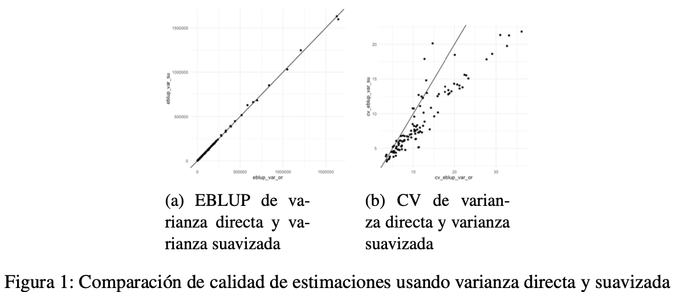
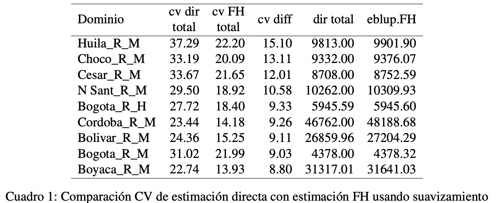
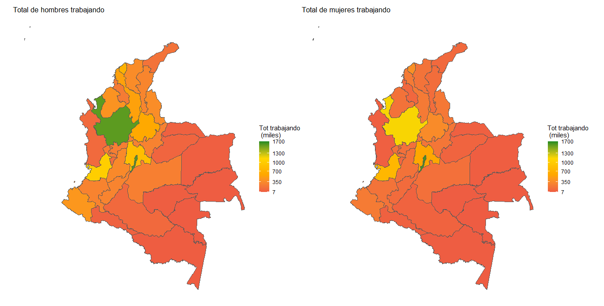

# Aplicación del modelo Fay-Herriot en la Gran Encuesta Integrada de Hogares (GEIH) diciembre 2022

"En este estudio se plantea el ajuste de un modelo Fay–Herriot para la estimación de personas trabajando dadas las desagregaciones por departamento, sexo y clase (Urbano o Rural). Para el ajuste se ha usado información de la Gran Encuesta Integrada de Hogares (GEIH) de diciembre de 2022 realizada por el DANE. Además, se uso como información auxiliar la proyección de habitantes de Colombia en el año 2022"

"Los resultados muestran una mejora en la calidad de la estimación pues se registra una disminución del coeficiente de variación de incluso el 15 %. Adicional, se realizan estimaciones de areas no muestreadas, en donde se observa coherencia de los resultados al verificar que estas son menores a la cantidad de personas en edad de trabajar"

Las estimaciones obtenidas (figura 1) realizando un proceso de suavizamiento de varianza presenta valores muy similares a los obtenidos con las varianzas directas, pero en cuanto al coeficiente de variación las estimaciones suavizadas presentan grandes ganancias en calidad 

Se pueden apreciar (cuadro 1) disminuciones del coeficiente de variación incluso del 15 % (Huila, para la sección rural para las mujeres) de la estimación de las personas que están trabajando. Para este caso, la estimación del total pasa de 9813 a 9901,9 personas que están trabajando

Se estima la cantidad de personas por departamento, por clase (urbano o rural), y pr sexo, como se muestra en los siguientes mapas

El codigo en R esta en el archivo "proyecto_sae_geih_2022.R"

